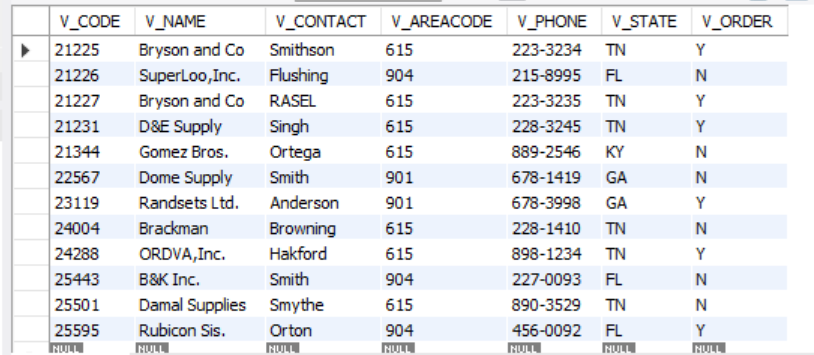

# Finals Lab Task 5 - Using SQL views and Stored Procedures and Stored Functions
In this lab activity, I worked with SQL Views, Stored Procedures, and Stored Functions in MySQL to create reusable database objects and automate specific queries and updates. The task was performed on the inventory database which contains tables for Products, vendors, and vendorsACode. This task focused on data filtering, aggregation, updating, and creating custom functions with parameters.

Here are the steps I followed:
- Created the database and tables
  - Used CREATE DATABASE inventory; to make the database.
  - Used USE inventory; to select the database.
  - Created tables Products, vendors, and vendorsACode with the required columns and constraints.
  - Inserted sample data into the tables for testing.
- Created Views
  - Created a view products_from_2002 to display vendor codes, vendor names, product descriptions, and product in-date for all products with p_indate from 2002 onwards.
  - Created a view to list all products with prices between 100 and 150.
  - Created a view to compute the total price of all products (P_ONHAND x P_PRICE) sold by specific vendors (v_codes 21344, 23119, and 24288).
- Created Stored Procedure
  - Developed a stored procedure to update the vendor name from 'Bryson,Inc.' to 'Bryson and Co.' based on a parameter.
- Created Stored Function
  - Created a stored function get_products_by_vendor that takes two parameters (v_code and v_state) and returns all product descriptions and prices for the specified vendor code and state.
- Called and tested all SQL objects
  - Used SELECT to test views.
  - Used CALL to run the stored procedure and verify the update.
  - Used SELECT to call the stored function and display results. 
## Here's the screenshot of my output for Task 1 - View products from 2002 onwards (See screenshot)

## Here's the screenshot of my output for Task 2 - Products priced between 100 and 150 (See screenshot)

## Here's the screenshot of my output for Task 3 - View total price of products by specific vendors (See screenshot)

## Here's the screenshot of my output for Task 4 - Stored Procedure updating vendor name (See screenshot)

## Here's the screenshot of my output for Task 5 - Stored Function returning product descriptions and prices (See screenshot)

